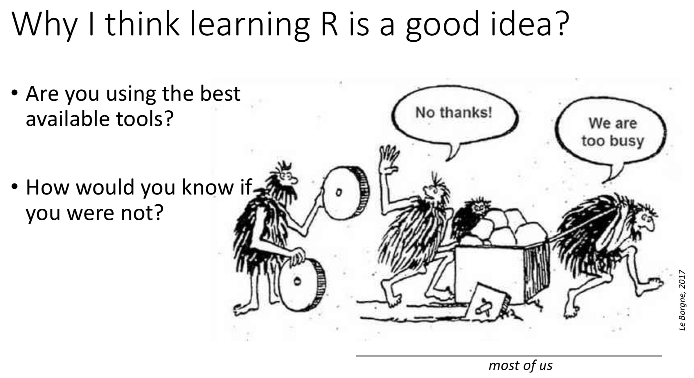
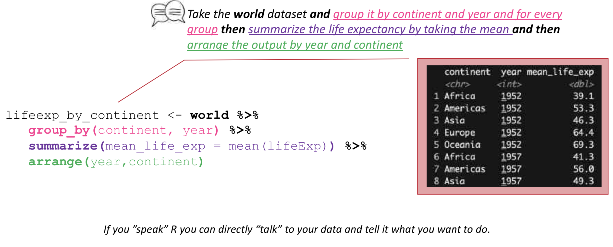
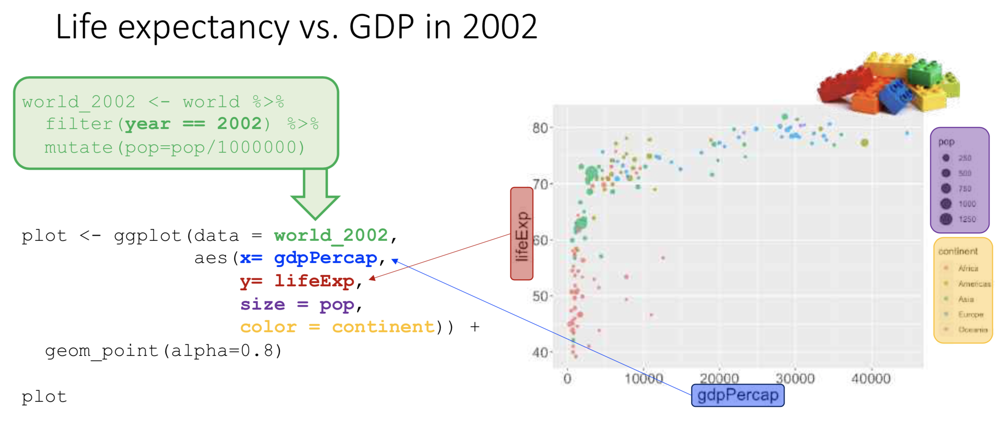

# Teaching & Learning R

Teaching the foundations of data analysis & visualization in R.

## Available resources
- *Presentation:* LearningR.pdf file in docs folder.

## Q&A:
If you have any questions please don't hesitate to contact me. Especially, if you attend the ETH course _Computational methods in system biology for omics analysis_

## Core concepts:
### Why learning R can accelerate your research

### Wrangling datasets in R

### Plotting datasets in R

### Further resources to continue learning R

